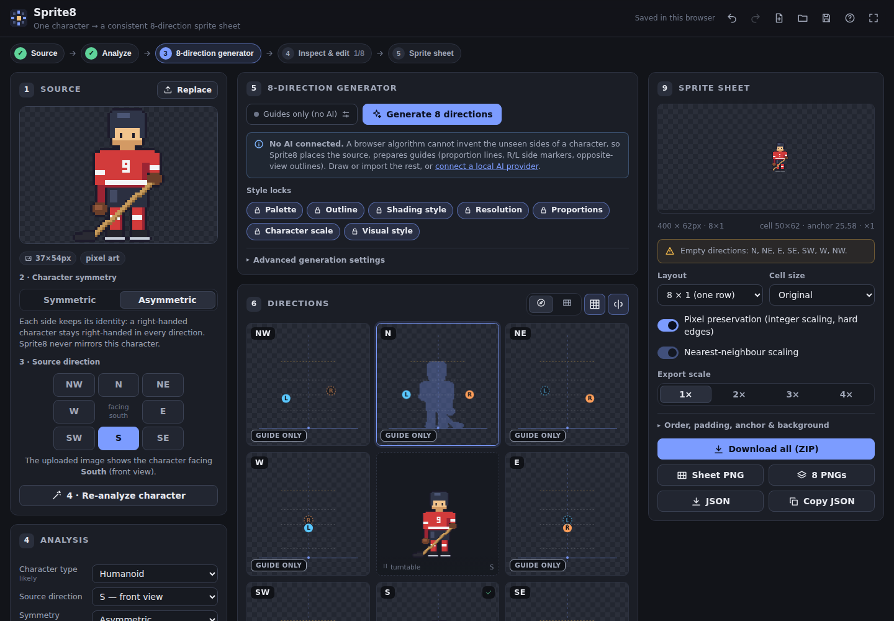
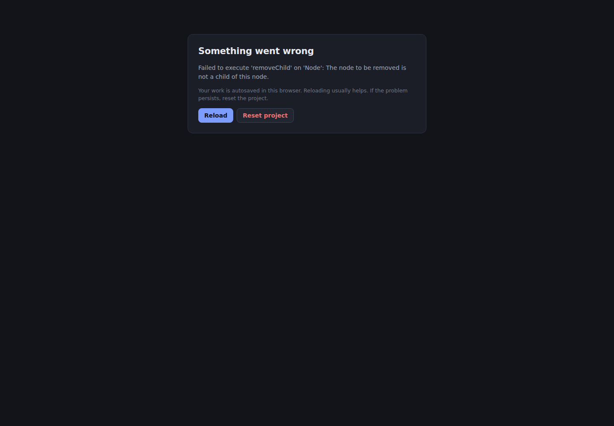

# Sprite8

**Turn one character sprite into a consistent 8-directional sprite sheet.**
Free, open source (MIT), runs entirely in your browser — no account, no ads, no subscription.

Sprite8 is a focused game-development tool, not a general image generator. You give it one
character image; it helps you produce the views facing **N, NE, E, SE, S, SW, W and NW** that still
look like the *same* character — same proportions, colours, outfit, equipment, scale and ground
position — and exports them as a game-ready sprite sheet with JSON metadata.



---

## What Sprite8 does — and what it honestly cannot do alone

Seeing the unseen side of a character (the back of a head, the far hand) needs an image model. A
browser algorithm cannot reconstruct it, and Sprite8 never pretends otherwise. The tool is split
into two clearly separated parts:

| Always available, deterministic (in your browser) | Needs an image model you choose |
| --- | --- |
| Background removal, pixel-art upscale detection, trimming | Drawing views of sides that are not visible in the source |
| Character analysis: silhouette, proportions, palette, outline, shading, symmetry, handedness guess | Variations of a generated view |
| A persistent **character model** every direction is generated and checked against | |
| **Asymmetry system**: where the right/left side, the weapon hand, a hockey stick must appear in every direction | |
| Construction guides: proportion lines, R/L side markers, the exact mirrored outline of the opposite view | |
| Mirroring partner views (E↔W, NE↔NW, SE↔SW) — *only* for symmetric characters and *only* if you enable it | |
| Consistency system: scale-to-reference, foot alignment, palette/outline locks, per-direction checks (height, ground line, palette, main colours, **mirrored-hand detection**) | |
| Pixel editor with onion skin, compare view, copy/paste between directions, undo/redo | |
| Sprite sheet, individual PNGs, JSON metadata, ZIP export | |

Image models are connected through a provider interface — Sprite8 is not tied to any vendor:
**ComfyUI**, **Stable Diffusion WebUI (A1111/Forge/SD.Next)** or **any server speaking the small
[Sprite8 HTTP protocol](docs/providers.md#sprite8-http-protocol-v1)** (a reference server and a
Hugging Face `diffusers` example are included). All of these run locally and for free. Without a
model Sprite8 is still a complete, guided manual workflow.

## Asymmetric characters are first-class

A right-handed hockey player must stay right-handed in every direction. Mirroring the east view to
get the west view would silently make them left-handed — so Sprite8 never mirrors an asymmetric
character. Instead its **asymmetry system** computes, for each direction, where each side of the
body appears:

| Facing | Character's **right** side appears… |
| --- | --- |
| **S** (front) | on the viewer's **left** |
| **SE** | on the left, nearer to the camera |
| **E** (right profile) | facing the camera, in front of the body |
| **NE** | on the right, nearer to the camera |
| **N** (back) | on the viewer's **right** |
| **NW** | on the right, behind the body |
| **W** (left profile) | on the far side, hidden behind the body |
| **SW** | on the left, behind the body |

These rules drive the R/L markers in every cell and in the editor, the per-feature hints ("Hockey
stick (right hand): on the RIGHT side of the image, in front"), the prompts sent to image models,
and a check that flags generated views whose one-sided equipment reaches the wrong way ("this view
may be mirrored"). Details: [docs/directions.md](docs/directions.md).

## Quick start

Requirements: [Node.js](https://nodejs.org/) 20.19+ or 22.12+.

```bash
git clone https://github.com/hannes423-debug/Sprite8.git
cd Sprite8
npm install
npm run dev          # http://localhost:5173
```

Or build the static site: `npm run build` → `dist/` (deployable anywhere, e.g. GitHub Pages — see
[Deploying](#deploying-to-github-pages)).

Try it without your own art: click **Hockey player (asymmetric)** or **Robot (symmetric)** in the
Source panel.

## Workflow

The main screen reads left to right (top to bottom on phones):

```
SOURCE  →  8-DIRECTION GENERATOR  →  N  NE  E  SE  S  SW  W  NW  →  SPRITE SHEET
```

1. **Upload** one character image (drop, tap or paste; transparent PNG works best — solid
   backgrounds are removed, upscaled pixel art is reduced to its native resolution).
2. Choose **Symmetric** or **Asymmetric**.
3. Select the **source direction** the image faces.
4. **Analyze**. Review the detected values (type, symmetry, dominant hand, camera, style, palette,
   proportions) and correct anything; add side-specific details such as "Hockey stick — right hand".
5. **Generate 8 directions** with the chosen provider.
6. **Inspect** all eight views side by side (compass layout with a turntable preview, or sheet
   order). Warnings flag height, ground-line, centring, palette, colour and handedness problems.
7. **Regenerate** a single direction — the other seven are never touched — or create a variation.
8. **Edit** any direction in the pixel editor.
9. **Export** the sprite sheet PNG, individual PNGs and JSON metadata (or everything as a ZIP).

Your work is autosaved in the browser (IndexedDB). Use **Save project** to get a portable
`*.sprite8.json` file. Full guide: [docs/user-guide.md](docs/user-guide.md).

## The editor



Pencil, eraser, fill, eyedropper, rectangle select/move, pan · brush sizes · mirror painting ·
copy/paste (also between directions, keeping the position) · flip, rotate (90° steps or any angle),
scale around the feet, opacity, crop to selection · symmetrize for front/back views · stamp the
opposite-view outline as a base layer · onion skin and a compare panel for any direction ·
pinch-zoom and touch painting on phones and tablets · full keyboard shortcuts · undo/redo shared with
the rest of the app.

## Export format

```json
{
  "character": "hockey_player",
  "directions": {
    "N": "hockey_player_N.png", "NE": "hockey_player_NE.png", "E": "hockey_player_E.png",
    "SE": "hockey_player_SE.png", "S": "hockey_player_S.png", "SW": "hockey_player_SW.png",
    "W": "hockey_player_W.png", "NW": "hockey_player_NW.png"
  },
  "cellWidth": 64,
  "cellHeight": 64,
  "anchor": { "x": 32, "y": 60 },
  "sheet": { "image": "hockey_player_sheet.png", "columns": 8, "rows": 1, "order": ["N", "NE", "E", "SE", "S", "SW", "W", "NW"] },
  "animation": { "name": "Idle", "frameCount": 1, "frames": { "N": [{ "x": 0, "y": 0, "w": 64, "h": 64, "file": "hockey_player_N.png" }] } }
}
```

Layouts: 8×1, 4×2, 2×4, 1×8, compass 3×3 or custom; any direction order. Options: target cell
size (original, 32, 48, 64, 96, 128 or custom), pixel preservation (integer scaling, hard edges),
nearest-neighbour scaling, padding, spacing, anchor point, transparent or coloured background,
export scale. All directions share one cell size, one anchor and one character scale. Full
specification: [docs/export-format.md](docs/export-format.md).

## Project structure

```
Sprite8/
├── src/
│   ├── core/                  # framework-free logic (unit tested in Node)
│   │   ├── sprite/            # Sprite Processor — raster ops, background, palette, outline, scaling
│   │   ├── analysis/          # Character Analysis
│   │   ├── character/         # Character Representation (the persistent character model)
│   │   ├── directions/        # Direction System + sheet layouts
│   │   ├── asymmetry/         # Asymmetry System — side visibility, handedness checks
│   │   ├── symmetry/          # Symmetry System — mirror rules, opposite-view outlines
│   │   ├── consistency/       # Consistency System — conform pipeline + reports
│   │   ├── generation/        # Direction Generator — prompts, inputs, orchestration
│   │   ├── providers/         # AI Provider abstraction + guides / ComfyUI / A1111 / HTTP
│   │   ├── animation/         # Animation System — animations × directions × frames
│   │   ├── export/            # Sprite Sheet Exporter — layout, metadata, ZIP
│   │   ├── project/           # project model + undo history
│   │   └── storage/           # Local Storage — IndexedDB, settings, project files
│   ├── editor/                # pixel editor engine (no React)
│   ├── app/                   # application state and actions
│   ├── ui/                    # React components and styles
│   └── platform/              # browser glue (canvas codec, downloads, fullscreen)
├── public/                    # static files (icons, web manifest)
├── assets/                    # example sprites (CC0)
├── models/                    # model integrations: ComfyUI templates, reference servers, licence notes
├── docs/                      # documentation
├── scripts/                   # asset generation
└── tests/                     # unit (Vitest) and end-to-end (Playwright) tests
```

Architecture overview: [docs/architecture.md](docs/architecture.md).

## Development

| Command | What it does |
| --- | --- |
| `npm run dev` | Dev server with hot reload (also provides `/proxy/...` routes to local AI servers) |
| `npm run build` | Type-check and build the static site into `dist/` |
| `npm run preview` | Serve the production build |
| `npm test` | Unit tests (Vitest) |
| `npm run test:e2e` | End-to-end tests (Playwright; run `npx playwright install chromium` once) |
| `npm run typecheck` · `npm run lint` · `npm run format` | TypeScript · oxlint · Prettier |
| `npm run assets` | Regenerate the example sprites and icons |
| `npm run reference-server -- --backend mock` | Sprite8 HTTP protocol test server |

The end-to-end suite covers the complete workflow (upload → asymmetric → source direction →
generate → edit one direction → export), the AI path through the protocol server, symmetric
mirroring rules, persistence, keyboard shortcuts and a phone-sized touch session.

## Deploying to GitHub Pages

The repository contains [`.github/workflows/deploy.yml`](.github/workflows/deploy.yml). In your
GitHub repository go to **Settings → Pages** and set **Source: GitHub Actions**; every push to
`main` then builds and publishes the site. The build uses relative paths, so it works under
`https://<user>.github.io/<repo>/` without configuration.

When Sprite8 runs from GitHub Pages (HTTPS) and your model server runs on your own computer, the
browser may ask for permission to access the local network, and the server must allow the page
via CORS. Running Sprite8 locally with `npm run dev` avoids both. See
[docs/providers.md](docs/providers.md#browsers-cors-and-local-servers).

## Roadmap

- **Phase 1 (done):** upload, preview, symmetric/asymmetric, source direction, 8-direction grid,
  deterministic processing, pixel editor, sprite sheet export.
- **Phase 2 (done):** provider abstraction, AI-assisted generation through local providers,
  persistent character model, consistency system, single-direction regeneration, reference views.
- **Phase 3 (data model ready):** animations (idle, walk, run, attack, skate, hurt, death, custom)
  with N frames per direction; frame duplication, multi-frame layouts and metadata already work.
  Next: pose control and a skeleton reference system, animation generation.
- **Phase 4:** in-browser models (WebGPU), deeper ComfyUI integration (workflow presets for
  multi-view and image-editing models), advanced character controls.

Details: [docs/roadmap.md](docs/roadmap.md).

## Licences

Sprite8 is released under the [MIT licence](LICENSE). The production build bundles only React,
ReactDOM and scheduler (all MIT). The example sprites are CC0. Image models and tools you connect
(ComfyUI, Stable Diffusion WebUI, model weights) are **not** part of Sprite8 and keep their own
licences — see [docs/licenses.md](docs/licenses.md) and [models/README.md](models/README.md).

## Contributing

Issues and pull requests are welcome. Please run `npm run check` (type-check, lint, unit tests)
and, for UI changes, `npm run test:e2e` before opening a pull request. New image backends should be
added as an `ImageGenerationProvider` — see [docs/providers.md](docs/providers.md#writing-a-provider).
